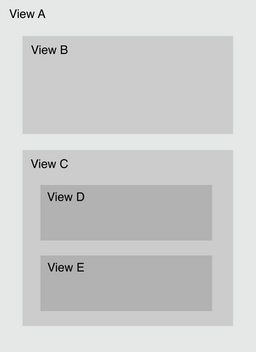
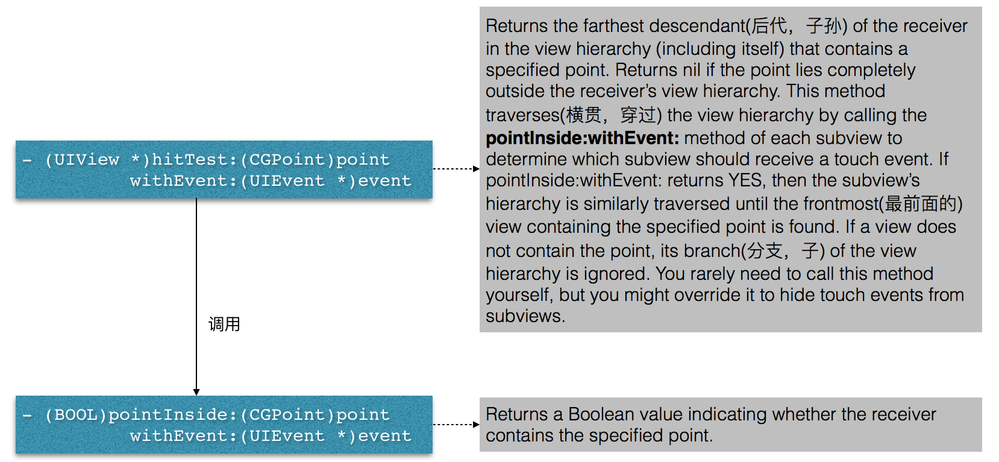

响应者链简单剖析
=================

Any time a finger touches the screen, dragged on the screen, or lifts from the screen, a UIEvent object is generated. The event object contains UITouch objects for all fingers on the screen。  

在UIResponder中有一个非常重要的概念叫做**Responder Chain**, 是按照一定规则组织的响应、处理事件的一条链表。该链表是由UIResponder对象组成的，它从第一个responder对象开始一直到application对象结束。如果第一个responder不能够处理该事件，则该事件会被发送到下一个在响应者链(responder chain)中的responder来处理。Responder chain遵循一个特定的传播路径，如果hit-test view不能够处理该事件，则UIKit会将事件传递给下一个responder. 如果走到最后(UIApplication)还没有响应，这个事件就会被悄悄的扔掉，不予理睬。 那么什么是hit-test view呢？  

**Hit-Testing**: 在IOS中通常使用 hit-testing 去找到那个被触摸的视图。这个视图叫hit-test view，当IOS找到hit-test view后就把touch event交个那个视图来处理。
下面画个图来说明一下，当点击视图E时看一下hit-testing的工作过程。  
     

1. 当点击手机屏幕时，iOS捕捉到该点击事件，一个UIEvent事件产生(UIEvent包含UITouch)
2. application分发事件(sendEvent:)，从window开始找，确定该事件发生在View A范围内，接下来测试View B以及View C
3. 检查发现事件不在View B范围内发生，接下来检查View C发现触摸事件发生在View C中，于是检查它的子视图View D和View E
4. 最后发现事件发生在View E的范围内，所以View E就成为了hit-test view（当然前提是View E可以处理点击事件，即它要是UIResponder的子类，并且没有禁掉识别事件的功能，如果View E不可以处理，则它会把这个事件交给它的下一个响应者，next responder来响应处理）
看一段英文描述：  

> The **hitTest:withEvent:** method returns the hit test view for a given CGPoint and UIEvent. The hitTest:withEvent: method begins by calling the **pointInside:withEvent:** method on itself. If the point passed into hitTest:withEvent: is inside the bounds of the view, pointInside:withEvent: returns YES. Then, the method recursively calls hitTest:withEvent: on every subview that returns YES.  

--------------------------------

**下一个响应者 nextResponder**
上面提到过，如果hit-test view不能够处理事件，则UIKit会将该事件传递给下一个responder，它是通过方法nextResponder找到下一个响应者的：  
**- (UIResponder *)nextResponder; // UIResponder.h**  
Returns the receiver's next responder, or nil if it has none.
The UIResponder class does not store or set the next responder automatically, instead returning nil by default. Subclasses must override this method to set the next responder. UIView implements this method by returning the UIViewController object that manages it (if it has one) or its superview (if it doesn’t); UIViewController implements the method by returning its view’s superview; UIWindow returns the application object, and UIApplication returns nil.

--------------------------------

当自己定义的一个类想让他成为first responder时需要做两件事：  
1. 重写 canBecomeFirstResponder 方法让他返回YES  
2. 接受 becomeFirstResponder 消息
在这里有一个地方需要注意， 当把一个对象变为first responder是要确保这个对象的图形界面已经建立起来，也就是说要在viewDidAppear中调用becomeFirstResponder方 法。如果在veiwWillAppear方法中调用becomeFirstResponder将会得到一个NO。

--------------------------------

可以参见Demo: ResponderChainDemo找找感觉

